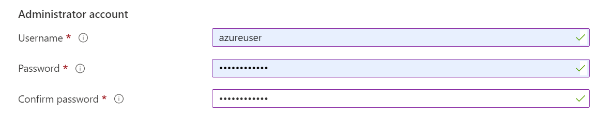
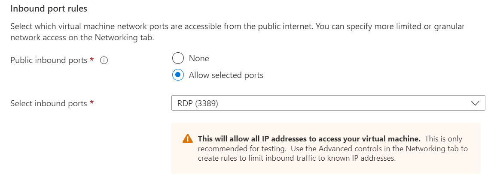

As máquinas virtuais (VM) do Azure podem ser criadas por meio do **Portal do Azure**.  
Esse início rápido mostra como implantar uma **VM Windows Server 2022 Datacenter** e habilitar **RDP** + instalar **IIS**.

---

## 🔑 Entrar no Azure
1. Acesse o portal: [https://portal.azure.com](https://portal.azure.com)  
2. Faça login com sua conta Azure.  

---

## 🚀 Criar a máquina virtual
1. No portal, pesquise **Máquinas virtuais**.  
2. Clique em **Criar** → **Máquina virtual do Azure**.  
4. Em **Detalhes da instância**:
   - Nome: `myVM`  
   - Imagem: **Windows Server 2022 Datacenter: Azure Edition - x64 Gen 2**  
   - Região: escolha uma próxima de você  
   - Tamanho: mantenha o padrão  
   -   

> ℹ️ Alguns usuários verão a opção de criar VMs em zonas de disponibilidade.
> https://learn.microsoft.com/pt-br/azure/virtual-machines/create-portal-availability-zone

5. Em **Conta de administrador**:
   - Usuário: `azureuser`  
   - Senha: mínimo 12 caracteres + complexidade  
   -   

6. Em **Regras de porta de entrada**:
   - Selecione **Permitir portas selecionadas**  
   - Ative **RDP (3389)** e **HTTP (80)**  
   -   

7. Clique em **Examinar + criar** → depois em **Criar**.  
   - .png)
  

8. Após a validação, clique em **Criar**.
 .png)

9.Após a conclusão da implantação, selecione Ir para o recurso.
 .png)

---

## 🔗 Conectar-se à máquina virtual
1. No portal → abra sua VM.
   .png)
3. Clique em **Conectar** → **RDP**.  
4. Baixe o arquivo `.rdp`.  
5. Abra-o e clique em **Conectar**.  
6. Na tela de login:  
   - Usuário: `localhost\\azureuser`  
   - Senha: definida na criação da VM  
7. Ignore o aviso de certificado clicando em **Sim**.  
 
---

## 🌐 Instalar servidor Web (IIS)
No **PowerShell** da VM, execute:  

```powershell
Install-WindowsFeature -name Web-Server -IncludeManagementTools

## 🌐 Exibir a página de boas-vindas do IIS
1. No portal, selecione a VM.  
2. Na visão geral da VM, passe o mouse sobre o **endereço IP** e clique em **Copiar para área de transferência**.  
3. Cole o IP em uma aba do navegador.  
4. A página de boas-vindas padrão do IIS será aberta e deve ter esta aparência:


